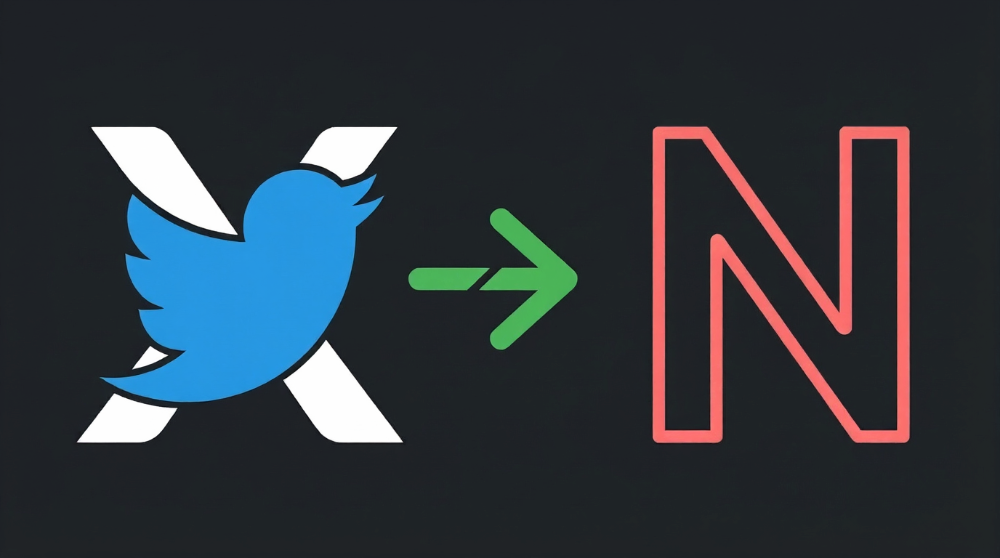
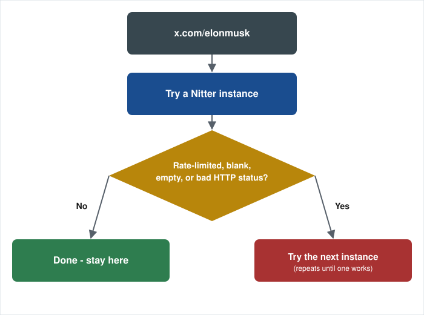

# Twitter/X to Nitter

A tiny Firefox extension that redirects `x.com` and `twitter.com` to a working Nitter frontend.

The request to X is **intercepted before it leaves your browser**. You never watch X load first, and X never receives the navigation.

> [!NOTE]
> **August 2026 cease-and-desist, and the September recovery.** On 24 August 2026, X Corp. sent cease-and-desist letters demanding a permanent takedown of Nitter instances and of the upstream [Nitter project itself](https://github.com/zedeus/nitter), and most public instances shut down. In early September 2026, after legal advice, upstream development resumed ("Nitter lives") and instances began coming back. This extension now tracks the [live instance health service](https://status.d420.de/) directly, activating and dropping instances as the fleet moves (see [Instances](#instances)). The fleet is still smaller and less stable than before the C&D; if every instance it can reach is down, you'll see a broken page rather than X.

> **Firefox Add-ons (AMO):** No public listing planned for now. Releases are private, unlisted signed builds (see Install below).

## What it does

  <picture>
    <source media="(prefers-color-scheme: dark)" srcset="assets/flow-diagram-dark.svg">
    
  </picture>

When you open an X/Twitter link:

1. The request is intercepted and redirected to a Nitter instance **before it is sent**. The decision is instant - nothing is fetched or checked first.
2. Which instance you get is decided from a locally cached ranking, refreshed in the background.
3. If that instance turns out to be unusable for you - rate limited, blocked, unreachable - the extension notices and moves you to the next candidate.

The candidate list itself is driven by two independent sources:

- **Fleet health** from the [Nitter Instance Health](https://status.d420.de/) service, polled about every 15 minutes in the background and cached locally. Its API exists to serve redirectors like this one. The extension activates any instance the service reports healthy, and drops it when the service does - but only within the set of domains the extension already has host permission for (see [Permissions](#permissions-and-why-each-is-needed)). A brand-new domain still needs a release to grant that permission. A small seed list is baked in for cold start and for when the service is unreachable.
- **Your own results.** The outcome of the pages you actually load is the only instance data specific to your network, and it takes priority over the service's view. The extension sends no probe traffic of its own to public Nitter instances.

Other behaviour:

- Preserves the original path and query string
- Redirects canonical status permalinks including `/i/status/<id>` and `/i/web/status/<id>`
- Leaves X-only surfaces alone: `/home`, `/notifications`, `/messages`, `/settings`, `/explore`, `/compose`, `/intent`, `/share`, `/login`, `/logout`, `/account`, `/tos`, `/privacy`, and the rest of `/i/*`
- Treats a 404 as a legitimate Nitter answer, not a broken instance
- Remembers instances that failed for you and demotes them for a while
- Stops redirecting a tab briefly if it detects a redirect loop
- Also falls back automatically if you land on a configured Nitter instance directly - a search result, a bookmark, a typed URL - and it fails, not just when the extension redirected you there itself. Clicking a link while already browsing Nitter is left alone rather than hijacked mid-navigation.
- Also falls back when an instance answers with a normal HTTP 200 page that is itself an error - a rate limit, exhausted auth tokens, or the instance's own shutdown notice - by checking the loaded page: if it doesn't look like a Nitter page at all (an operator's own custom down-page, regardless of wording), or if Nitter's own error panel names a known instance-level failure, that counts as a failure. A plain "not found" result, or a Cloudflare human-verification page that's still resolving, does not. This only runs on a navigation the extension is actively deciding the outcome of, never on ordinary Nitter browsing.

## Instances

The extension redirects to any instance the [health service](https://status.d420.de/) currently reports healthy, as long as `manifest.json` already grants host permission for that domain. Two lists in the source define the bounds:

**Seed list** (`SEED_INSTANCES` in `background.js`) - used at startup and whenever the health service is unreachable or stale:

- nitter.kareem.one
- nitter.jaydenha.uk
- nitter.click
- nitter.meowing.monster
- nitter.netbub.com
- nitter.miningtcup.me
- shitter.thepixora.com
- xcancel.com

**Permitted superset** (host permissions in `manifest.json`) - the seed list plus `nitter.xitter.cc`. The health service can activate or deprioritise any of these live between releases. It cannot introduce a domain outside this set: the extension discards any host from the health data that the manifest does not already list, and re-checks at the point of use. (Firefox itself does not restrict redirect targets - that check is done in the extension's own code.) Seed instances are never fully dropped, only pushed down the ranking when the service marks them unhealthy.

`lightbrd.com` stays excluded regardless of uptime: it doesn't proxy images/video/GIFs and loads Microsoft Clarity analytics, per [zedeus/nitter#1209](https://github.com/zedeus/nitter/issues/1209).

If every reachable instance is unhealthy, the extension still sends you to the least-bad one rather than to X - redirecting to Nitter is the whole point. A daily CI check reports the seed list and the permitted superset against the health service, flags any healthy instance not yet permitted (those need a release), and verifies that each seed instance still serves real Nitter markup.

If you're maintaining a fork: adding a genuinely new domain means editing both `SEED_INSTANCES` in `background.js` and the host permissions in `manifest.json`, then bumping the version, re-signing, and publishing a new `.xpi`. Instances already in the permitted superset need no release to come and go - the health service drives that.

## Install

### Temporary (development)

1. Open `about:debugging#/runtime/this-firefox`
2. Click "Load Temporary Add-on"
3. Select `manifest.json` from this folder

This is wiped on every Firefox restart.

### Permanent

Download the signed `.xpi` from the [latest release](https://github.com/deroverda/twitter-to-nitter/releases/latest), then install it through `about:addons` → gear icon → "Install Add-on From File...".

Current releases are privately signed "unlisted" builds made via [`web-ext sign`](https://extensionworkshop.com/documentation/publish/signing-and-distribution-overview/) with a free Mozilla developer account.

## Permissions, and why each is needed

- `webRequest` + `webRequestBlocking` - to intercept the X/Twitter request and redirect it **before it is sent**, and to see the HTTP status of the Nitter page you land on
- Host access to `x.com` and `twitter.com` (plus their `www.`, `mobile.` and `m.` forms) - required to intercept those requests at all
- Host access to each Nitter instance in the permitted superset (see [Instances](#instances)) - required to redirect to them and read the response status. This is a fixed list in `manifest.json`; the health service selects which of them are active but cannot add to it
- Host access to `status.d420.de/api/*` - to fetch the fleet health data (see [Instances](#instances)); no other path on that domain is requested
- `storage` - to remember the cached ranking and which instances failed for you

**Why the X host permission is worth it.** An earlier version avoided it, and the cost was that X still received your request while the extension decided where to send you. Intercepting properly is what makes the guarantee real: with these permissions, **X is never contacted at all**. The permission buys the privacy, it doesn't spend it.

No `<all_urls>`. No access to any site other than X/Twitter and the Nitter instances listed in `manifest.json`.

## Privacy

No telemetry, no analytics, no tracking, no backend of ours.

- **X never receives your request**, with three narrow exceptions. In normal use the request to `x.com` / `twitter.com` is redirected inside your browser before it is sent, so X does not learn that you clicked. The exceptions: the paths listed under Known limitations stay on X by design; if the extension detects a redirect loop it stops intercepting that tab briefly as a safety valve, and the request then reaches X; and a `t.co` short link (Twitter's own URL shortener) is not intercepted, so `t.co` sees the click before the real `x.com` request that follows is redirected.
- **Your URL goes to one Nitter instance at a time** - the one you are redirected to. That instance is a third party and it necessarily sees what you asked it for. If that instance fails, the extension falls back to another permitted instance, so the same path may reach more than one instance sequentially over the course of one navigation - never simultaneously, and never to any domain outside the permitted superset listed above.
- **The health service receives no browsing data.** The extension requests one fixed URL with no parameters and no cookies, on a timer, identical for every user and unrelated to what you browse. It is never contacted as part of a navigation.
- **The extension sends no probe traffic to Nitter instances.** Instance health is learned from pages you loaded anyway.
- **The extension checks the loaded page for a small set of structural signals: whether it looks like a genuine Nitter page at all, and if so, whether Nitter's own error panel names a known instance-level failure.** This runs only on a navigation the extension is actively deciding the outcome of. The rest of the page - what you searched for, whose profile you viewed, the actual tweet content - is never read, stored, or sent anywhere; the check only ever produces a true/false result kept in memory for that one decision.
- Instance health and ranking are stored locally and never leave your browser.

One thing this extension cannot do anything about: **some Nitter instances do not proxy media.** On those, your browser loads images and video directly from Twitter's CDN (`pbs.twimg.com`, `video.twimg.com`), which means Twitter-owned infrastructure still sees which profile and media you viewed. Whether media is proxied is the instance operator's choice, not something a redirector can change. If that matters to you, prefer an instance with proxying enabled, or run your own.

## Known limitations

- Nitter's own "Open in X" link does not work, because the extension intercepts that navigation too. Use a private window or disable the extension to reach X deliberately.
- The health service can activate and drop instances live, but only within the fixed permitted superset in `manifest.json`. A genuinely new domain still needs an updated build.
- On instances that do not proxy media, media still loads from Twitter's CDN. See Privacy above.
- `/home`, `/notifications`, `/messages`, `/settings`, `/explore`, `/compose`, `/intent`, `/share`, `/login`, `/logout`, `/account`, `/tos`, and `/privacy` stay on X, because Nitter has no equivalent for them.

## No dependencies

Just `manifest.json`, `background.js`, and `check-page.js` (a small file-based content script, injected only into actively-tracked navigations to check for instance failure - see Privacy above; it's a separate file rather than inline code because some pages' own CSP blocks inline script injection). No build step, no npm packages, no framework.
