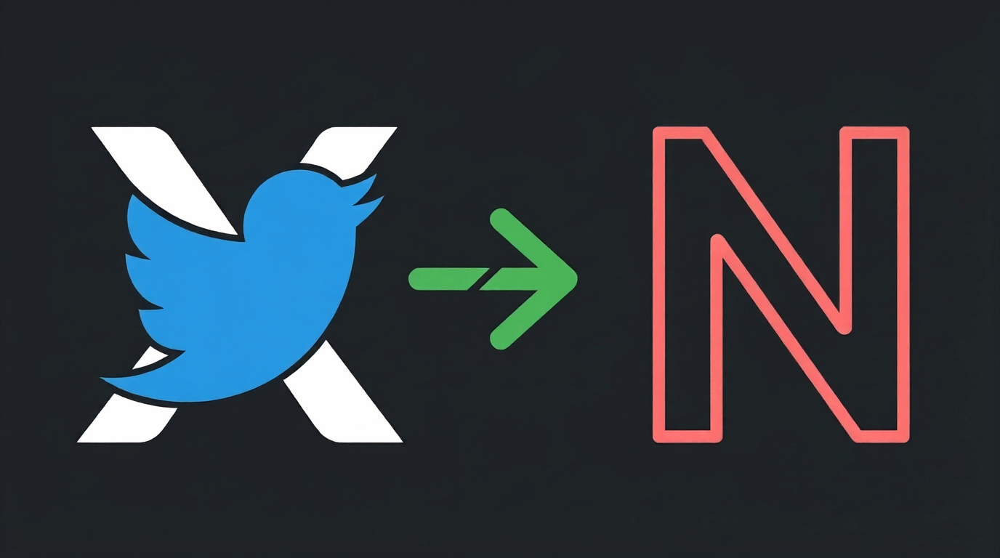
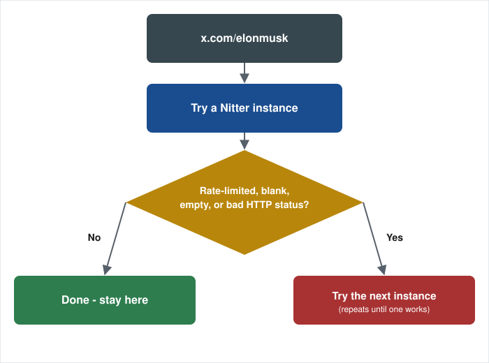

# Twitter/X to Nitter

A tiny Firefox extension that redirects `x.com` and `twitter.com` to a working Nitter frontend.

The X request is **intercepted before it leaves your browser**. X never receives the navigation or gets to load first.

**[Install from Firefox Add-ons (AMO)](https://addons.mozilla.org/firefox/addon/twitter-x-to-nitter/)**

> [!NOTE]
> Since X Corp.'s cease-and-desist letters in August 2026, fewer public Nitter instances are running and they are less stable than before. To cope with this, the extension follows a [live instance health service](https://status.d420.de/) and falls back automatically; if every instance fails, it shows a failure page rather than sending you to X. See [Background](#background) for the full story.

## What it does

  <picture>
    <source media="(prefers-color-scheme: dark)" srcset="assets/flow-diagram-dark.svg">
    
  </picture>

When you open an X/Twitter link:

1. The request is intercepted and redirected to Nitter **before it is sent**. Nothing is fetched or checked first.
2. The instance is selected from a locally cached ranking, refreshed in the background.
3. If the instance is rate limited, blocked, or unreachable, the extension falls back to the next candidate.

**Preferred instance:** Click the toolbar icon while on a Nitter page to prefer that instance for future fresh redirects. This is useful because per-instance settings and capabilities such as RSS and NSFW support do not follow automatic switches, and the health ranking cannot know your preferences. If the preferred instance fails, normal fallback still applies, and the preference remains set for when it recovers.

### Instance selection

The candidate list combines two independent sources:

* **Fleet health:** The [Nitter Instance Health](https://status.d420.de/) service is polled about every 15 minutes and cached locally - see [Instances](#instances) for which domains it can activate and how the seed list works.
* **Your results:** Actual navigation outcomes are specific to your network and take priority over the service's view. The extension sends **no probe traffic** to Nitter instances.

The extension also:

* Preserves the original path and query string, minus X's share-tracking parameters (`s`, `t`, `ref_src`, `ref_url`). Nitter ignores them, so forwarding them would only pass X's tracking token to the instance operator.
* Redirects canonical status URLs including `/i/status/<id>` and `/i/web/status/<id>`.
* Leaves X-only surfaces such as `/home`, `/notifications`, `/messages`, `/settings`, `/explore`, `/compose`, `/intent`, `/share`, `/login`, `/logout`, `/account`, `/tos`, `/privacy`, and the rest of `/i/*` on X.
* Treats a 404 as a valid Nitter response.
* Remembers instances that failed for you and temporarily demotes them, for longer the worse the failure was and the more often it repeats. A rate limit clears in minutes; a host that stops resolving is held down far longer.
* Temporarily stops redirecting a tab if it detects a redirect loop.
* Detects failures regardless of how you reached Nitter: the extension's redirect, search result, bookmark, typed URL, or link clicked while already browsing Nitter.
* Detects HTTP 200 pages that are actually instance failures, including custom operator shutdown pages, rate-limit pages, exhausted auth tokens, and known Nitter instance-error panels. A normal "not found" page is not treated as a failure.
* Never navigates away from a Cloudflare, Anubis, or go-away verification page, so you can finish solving it (Anubis and go-away usually solve themselves without any input from you). The instance is briefly deprioritised so the next fresh redirect prefers one that is not challenging you; completing the challenge clears that immediately. Anti-bot interstitials from other providers are not recognised and are treated as pages that failed to render.
* Performs the page-content check only while the extension is actively deciding a tracked navigation, not during ordinary Nitter browsing.

## Instances

The extension can use any instance currently reported healthy by the [health service](https://status.d420.de/) **provided its domain is already in `manifest.json` host permissions**.

**Seed list** (`SEED_INSTANCES` in `background.js`):

* `nitter.jaydenha.uk`
* `nitter.meowing.monster`
* `nitter.netbub.com`
* `shitter.thepixora.com`
* `nitter.xitter.cc`

**Permitted superset** (`manifest.json`):

The seed list plus `nitter.kareem.one`, `nitter.click`, and `nitter.miningtcup.me`. These three were dropped from the seed list after repeated failures but stay permitted, so the health service can bring them back without a release when they recover.

The health service can activate or deprioritise these domains between releases, but cannot introduce new domains. Hosts outside the manifest are discarded and re-checked at use time. Seed instances are never completely removed; unhealthy ones are simply pushed down the ranking.

`lightbrd.com` is permanently excluded because it does not proxy images/video/GIFs and loads Microsoft Clarity analytics, according to [zedeus/nitter#1209](https://github.com/zedeus/nitter/issues/1209).

If every reachable instance is unhealthy, the extension still redirects to the least-bad configured instance rather than X.

A daily CI check compares the seed list and permitted superset with the health service, flags healthy instances that still need host permission, and verifies that seed instances serve real Nitter markup.

### Maintaining a fork

A fork needs its own add-on ID: change `browser_specific_settings.gecko.id` in `manifest.json` before signing, since the current ID belongs to the AMO listing.

Adding a new domain requires:

1. Add it to `SEED_INSTANCES` in `background.js`.
2. Add its host permission to `manifest.json`.
3. Bump the version.
4. Sign and distribute a new `.xpi`.

Domains already in the permitted superset require no release to become active or inactive.

## Install

Install from [Firefox Add-ons](https://addons.mozilla.org/firefox/addon/twitter-x-to-nitter/). Updates are delivered automatically.

### Development install

1. Open `about:debugging#/runtime/this-firefox`.
2. Click **Load Temporary Add-on**.
3. Select `manifest.json`.

Temporary installations are removed when Firefox restarts.

## Permissions and why they are needed

* `webRequest` + `webRequestBlocking` - intercept X/Twitter navigation before it is sent and observe Nitter response status.
* X/Twitter host access, including `www.`, `mobile.`, and `m.` - required to intercept those requests.
* Host access to the permitted Nitter instances - required to redirect to them and inspect their responses.
* `status.d420.de/api/*` - fetches fleet health data. No other path on that domain is requested.
* `storage` - stores the cached ranking and locally observed failures.

The X permission is necessary because blocking a request requires host permission for the domain being blocked. Without it, X would still receive the request while the extension decided where to redirect.

**No `<all_urls>`.** The extension has access only to X/Twitter, the configured Nitter instances, and the health API.

## Privacy

**No telemetry, analytics, tracking, or backend operated by this project.**

* **X normally never receives the navigation.** Exceptions:

  * X-only paths listed above intentionally remain on X.
  * If a redirect loop is detected, interception is briefly disabled for that tab and the request can reach X.
  * `t.co` links are not intercepted, so Twitter's URL shortener sees the click before the resulting X navigation is redirected.
* **One Nitter instance receives each request at a time.** A failed instance may be followed sequentially by another permitted instance during the same navigation, never simultaneously and never outside the permitted superset.
* **Operators see your IP address.** Each Nitter instance you land on is run by an independent operator who can see your IP address and which pages you open, as with any website. The [health service](https://status.d420.de/about) is also run by an operator its site does not name, and it can see your IP address and when you are online. The extension cannot hide either from them.
* **The health service receives no browsing data.** The extension requests one fixed, parameter-free URL without cookies about every 15 minutes, identically for every user. It is never contacted as part of navigation.
* **No Nitter probing.** Instance-specific health comes only from pages the user actually loads.
* **Page checks stay in your browser.** For a navigation the extension is tracking, a small script reads the page's markup and text to tell a Nitter page from a verification page, an error page, or something else. That includes searching the text for known failure phrases such as "rate limit". The page is not stored or sent anywhere; only a temporary result for that navigation is kept.
* Instance health and rankings remain local to the browser.

### Media privacy

Some Nitter instances do not proxy media. On those instances, images and video load directly from Twitter's CDN (`pbs.twimg.com`, `video.twimg.com`), so Twitter-owned infrastructure can see which profile/media was requested. Media proxying is controlled by the instance operator. Prefer a proxying instance or run your own if this matters.

## Known limitations

* Nitter's **Open in X** link is intercepted too. Use a private window or disable the extension to deliberately open X.
* The health service can only activate domains already permitted by `manifest.json`; new domains require a release.
* Non-proxying Nitter instances load media from Twitter's CDN.
* X-only paths listed under [What it does](#what-it-does) remain on X.
* Pressing **Back** after a fallback can trigger the same fallback again because the browser reloads the page the extension switched away from.
* A Cloudflare, Anubis, or go-away challenge that never resolves is a dead end for that navigation, for example Anubis with JavaScript blocked. The extension will not redirect away from one, because it cannot tell someone part-way through solving it from a challenge that is stuck. Opening the X link again picks a different instance, since the challenging one is briefly deprioritised. Challenges from other providers are detected only as "this did not render as Nitter", so the extension falls back to the next instance instead of waiting for you to solve them.
* Failure phrases such as `"rate limit"`, `"no auth tokens"`, and `"too many requests"` are recognised only in English. Structural checks can still detect pages that do not resemble Nitter.

## Background

On 24 August 2026, X Corp. sent cease-and-desist letters demanding the takedown of Nitter instances and the upstream [Nitter project](https://github.com/zedeus/nitter), causing most public instances to shut down. In early September, after legal advice, the project announced it would continue ("Nitter lives") and instances began returning. The upstream repository was archived on 11 September 2026; individual Nitter-compatible instances remain separately operated.

## No runtime dependencies

The extension ships only:

* `manifest.json`
* `background.js`
* `check-page.js`
* `terminal-failure.html`
* `terminal-failure.js`
* `popup.html`
* `popup.js`
* `icon.png`

There is no build step, framework, or bundled dependency.

`check-page.js` is a separate file because some pages' CSP blocks inline script injection. It runs only on actively tracked navigations.

`terminal-failure.html/js` is a packaged extension page shown when no instance works for a navigation; Firefox's `tabs.update()` rejects `data:` URLs.

`popup.html/js` provides the toolbar popup for selecting a preferred instance.

The repository also contains a `test/` harness run with `node --test` (`npm test`). It has one dev-only dependency, `linkedom`, for parsing HTML fixtures. Tests are not part of the extension and are excluded from the `.xpi`.
